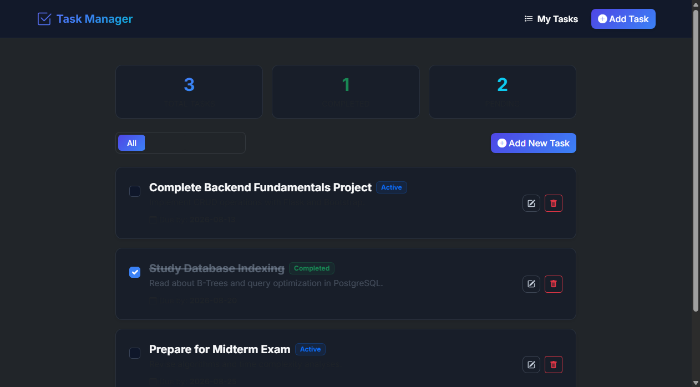
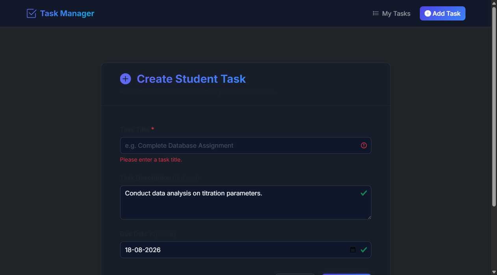
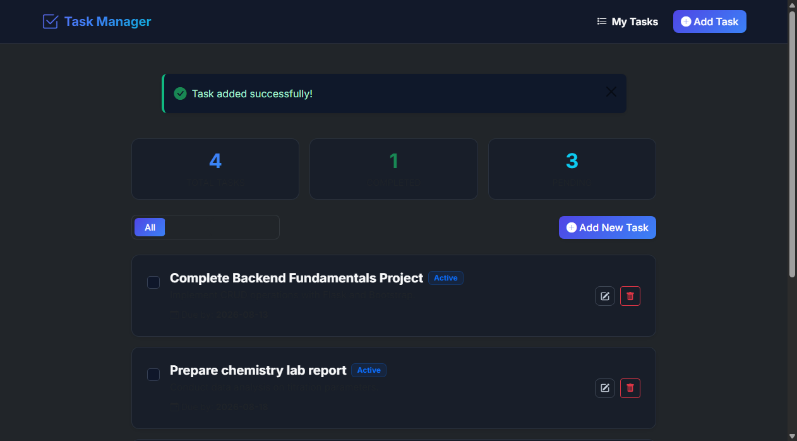
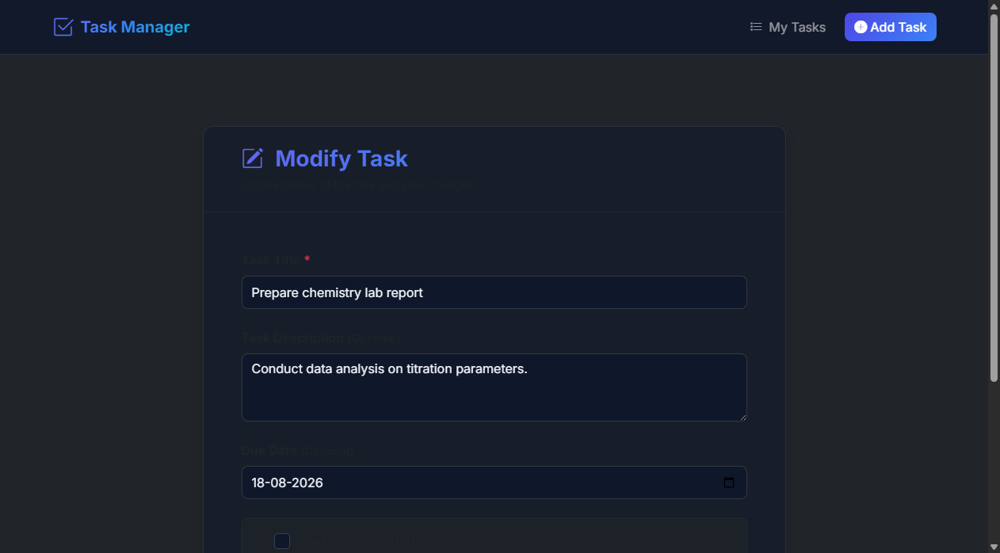
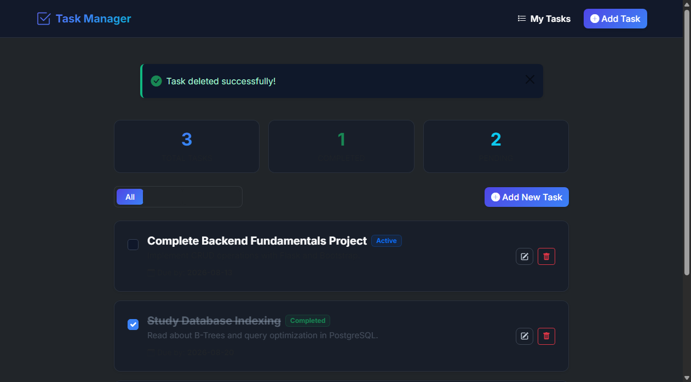

# Student Task Manager - Project Submission Report

## Task Title
Demonstrating Backend Fundamentals with a Student Task Manager Web Application

## Objective
To build a simple, responsive, and functional server-side web application using the Flask framework in Python. The application demonstrates core backend concepts including:
- **Routing:** Handling HTTP GET and POST requests for multiple endpoints.
- **GET/POST Form Handling:** Capturing client inputs, validation, and status feedback via flash notifications.
- **SQLite Database Integration (CRUD):** Creating, reading, updating, and deleting tasks dynamically in a relational SQL database.
- **Responsive Interface:** Constructing templates using Jinja2 and Bootstrap 5 to deliver an engaging user interface.

## Technologies Used
* **Python:** Core programming language.
* **Flask:** Backend web framework.
* **HTML & Jinja2:** Markup and server-side template engine.
* **Bootstrap:** Front-end responsive CSS framework.
* **SQLite & Flask-SQLAlchemy:** Relational database storage and object-relational mapping (ORM).

---

## Project Description
The **Student Task Manager** is a productivity dashboard designed for students to organize, track, and complete school assignments. Users can create tasks with titles, descriptions, and due dates. Tasks can be filtered by active or completed status, toggled as completed dynamically, edited to update parameters, or deleted entirely.

---

## Features Implemented
1. **Dynamic Task Feed:** Displays list of tasks sorted by due dates and creation times.
2. **Filters (All, Active, Completed):** Filter display of tasks instantly using GET query parameters.
3. **Interactive Completion Toggle:** Toggles task completed state via checkbox inputs on the home dashboard page.
4. **Form Validation:** Prevents form submission if required fields (Title) are missing and retains user inputs.
5. **Flash Alerts:** Provides immediate visual feedback (success/error alerts) for user actions.
6. **Task Status Highlights:** Renders badges showing whether a task is active, completed, or overdue (comparing due date to current server time).
7. **Responsive Premium UI:** Features custom dark-navy background colors, glassmorphic navigation panels, and smooth hover scales on layout cards.

---

## Project Structure
```text
flask mini project/
├── app.py                  # Core Flask server and SQL database schema
├── database.db             # SQLite Database (generated on first execution)
├── requirements.txt        # Declarative package dependencies list
├── README.md               # Quickstart guide
├── static/
│   └── style.css           # Custom dark theme overrides for Bootstrap
└── templates/
    ├── base.html           # Core HTML header, navbar, footer layout
    ├── index.html          # Tasks dashboard feed listing page
    └── form.html           # Reusable add/edit task form template
```

---

## Important Code Snippets

### 1. Flask Routes & GET/POST Form Handling
Below is the section of `app.py` displaying route configurations for displaying tasks, creating new tasks, and handling dynamic query string states.

```python
# READ: Home / task list route
@app.route('/')
def index():
    status_filter = request.args.get('filter', 'all')
    query = Task.query
    if status_filter == 'completed':
        query = query.filter_by(completed=True)
    elif status_filter == 'active':
        query = query.filter_by(completed=False)
        
    tasks = query.order_by(Task.due_date.asc(), Task.created_at.desc()).all()
    return render_template(
        'index.html',
        tasks=tasks,
        current_filter=status_filter,
        total_count=Task.query.count(),
        completed_count=Task.query.filter_by(completed=True).count(),
        pending_count=Task.query.count() - Task.query.filter_by(completed=True).count()
    )

# CREATE: Add Task route
@app.route('/add', methods=['GET', 'POST'])
def add_task():
    if request.method == 'POST':
        title = request.form.get('title', '').strip()
        description = request.form.get('description', '').strip()
        due_date = request.form.get('due_date', '').strip()

        if not title:
            flash('Task title is required.', 'danger')
            return render_template('form.html', action_url=url_for('add_task'), is_edit=False, task_data=request.form)

        new_task = Task(title=title, description=description, due_date=due_date if due_date else None, completed=False)
        db.session.add(new_task)
        db.session.commit()
        flash('Task added successfully!', 'success')
        return redirect(url_for('index'))
    return render_template('form.html', action_url=url_for('add_task'), is_edit=False, task_data={})
```

### 2. Database/CRUD Code (Task Model & Complete / Delete Routes)
SQLAlchemy model mapping tasks to SQLite database columns, alongside route handlers representing updates and deletions.

```python
# Task Schema Model
class Task(db.Model):
    id = db.Column(db.Integer, primary_key=True)
    title = db.Column(db.String(100), nullable=False)
    description = db.Column(db.String(300), nullable=True)
    due_date = db.Column(db.String(10), nullable=True)  # Format: YYYY-MM-DD
    completed = db.Column(db.Boolean, default=False, nullable=False)
    created_at = db.Column(db.DateTime, default=datetime.utcnow)

# UPDATE: Edit existing task fields
@app.route('/edit/<int:id>', methods=['GET', 'POST'])
def edit_task(id):
    task = Task.query.get_or_404(id)
    if request.method == 'POST':
        title = request.form.get('title', '').strip()
        description = request.form.get('description', '').strip()
        due_date = request.form.get('due_date', '').strip()
        completed = 'completed' in request.form

        if not title:
            flash('Task title is required.', 'danger')
            return render_template('form.html', action_url=url_for('edit_task', id=id), is_edit=True, task_data=request.form, task=task)

        task.title = title
        task.description = description
        task.due_date = due_date if due_date else None
        task.completed = completed
        db.session.commit()
        flash('Task updated successfully!', 'success')
        return redirect(url_for('index'))
    
    task_data = {'title': task.title, 'description': task.description, 'due_date': task.due_date, 'completed': task.completed}
    return render_template('form.html', action_url=url_for('edit_task', id=id), is_edit=True, task_data=task_data, task=task)

# DELETE: Remove task
@app.route('/delete/<int:id>', methods=['POST'])
def delete_task(id):
    task = Task.query.get_or_404(id)
    db.session.delete(task)
    db.session.commit()
    flash('Task deleted successfully!', 'success')
    return redirect(url_for('index'))
```

### 3. Template/Jinja Code
Snippet from `templates/index.html` illustrating Jinja2 loops and conditional statements to display lists of tasks or empty state warnings:

```html

    <div class="card bg-glass text-center py-5">
        <h4 class="fw-bold">No Tasks Found</h4>
        <p class="text-muted">Your task board is empty. Add a task to get started!</p>
    </div>

    <div class="d-flex flex-column gap-3">
        
            <div class="card bg-glass border-success border-opacity-10">
                <div class="card-body p-4 d-flex align-items-start gap-3">
                    <!-- Checkbox Completion Form (Submits onChange) -->
                    <form action="{{ url_for('complete_task', id=task.id) }}" method="POST">
                        <input class="form-check-input fs-5" type="checkbox" checked onChange="this.form.submit();">
                    </form>
                    
                    <div class="flex-grow-1">
                        <h5 class="task-completed-title">
                            {{ task.title }}
                        </h5>
                        <p class="text-muted">{{ task.description }}</p>
                    </div>
                </div>
            </div>
        
    </div>

```

---

## Screenshots

### 1. Home Page Dashboard
*Shows the list of current student tasks, overview metrics (total, completed, pending), filters, and task status badges.*  


### 2. Add Task Form
*Shows the form input fields (Title, Description, Due Date) with client validation prompts active.*  


### 3. Added Data (Successful Flash Alert)
*Shows the dashboard redirected view displaying a green success message "Task added successfully!" with the new task card in the list.*  


### 4. Edit Task Page
*Shows the edit screen with form inputs pre-populated with data, including the "Mark as Completed" checkbox.*  


### 5. Delete Task Operation
*Shows the browser confirmation pop-up when clicking the trash bin icon, and the subsequent "Task deleted successfully!" toast message.*  


---

## GitHub Repository Link
[https://github.com/altaf/flask-mini-project](https://github.com/altaf/flask-mini-project)

## Live Demo Link (Optional)
[http://127.0.0.1:5000](http://127.0.0.1:5000) *(Running locally on development machine)*

---

## Conclusion
Building the Student Task Manager successfully demonstrates the integration of an SQL database engine with a Python backend HTTP server. The core requirements of server routing, template parsing, form data parsing, and CRUD validations were met using Flask and SQLite. The interface uses Bootstrap 5 utility classes to render a modern, responsive user portal.
